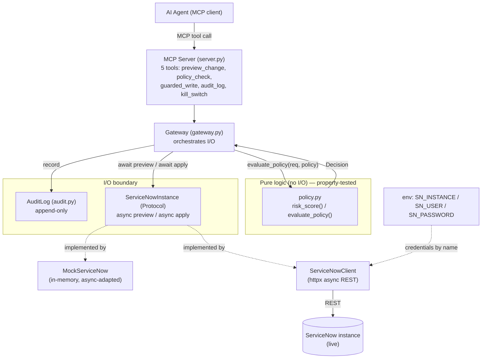
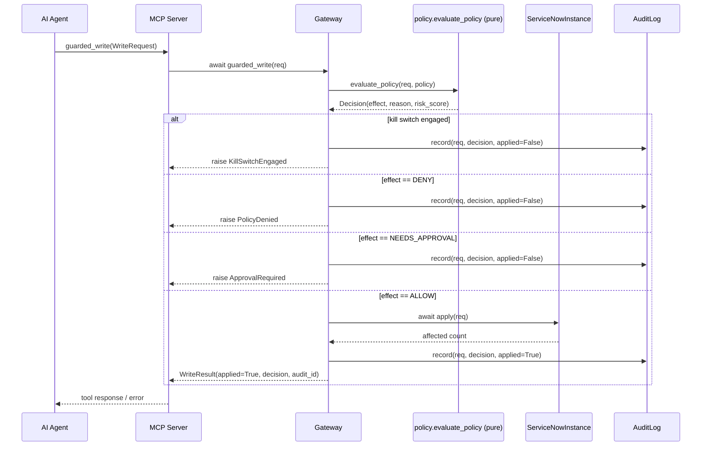

# Design Document

## Overview

SentinelNow is an AI-agent safety gateway for ServiceNow. It sits between an AI agent
(the MCP client) and a ServiceNow instance, and makes every intended write
**previewable, risk-scored, policy-gated, auditable, and reversible** through a kill
switch. The design extends the existing scaffold in `src/sentinelnow/` rather than
replacing it.

The central design principle — reinforced by project steering — is **separation of pure
decision logic from I/O**:

- `policy.py` holds pure, synchronous, side-effect-free functions (`risk_score`,
  `evaluate_policy`). They take data in, return a `Decision`, and touch nothing else.
  This is what makes the guarantees in Requirements 1–4 and 8 property-testable.
- `gateway.py` orchestrates I/O: it calls the pure policy functions, performs
  instance reads/writes through an async `ServiceNowInstance`, and appends to the audit
  log. All I/O-bound gateway methods become `async def` per steering ("async def for all
  ServiceNow REST calls").
- `server.py` adapts the gateway to the Model Context Protocol, exposing five tools.

The gateway talks to the instance through a narrow `ServiceNowInstance` **Protocol**
(`preview` + `apply`). `MockServiceNow` (async-adapted) and a new httpx-based
`ServiceNowClient` both satisfy it, so the gateway and the entire policy layer run
unchanged against either backend (Requirement 11).

This design covers all eleven requirements. Property-based testing (PBT) **is**
appropriate here: `risk_score` and `evaluate_policy` are pure functions with universal
properties over a large input space (operations, batch sizes, priorities, policy
configurations), so a dedicated Correctness Properties section follows.

### Key design decisions

| Decision | Rationale |
| --- | --- |
| Keep policy logic pure and synchronous | Pure functions are trivially property-testable and have no I/O to mock. Requirements 1–4, 8 are all statements about these functions. |
| Make gateway I/O methods `async def` | Steering mandates async for ServiceNow REST calls; the real client is network-bound. The mock is async-adapted so one code path serves both. |
| Narrow `ServiceNowInstance` Protocol (`preview`/`apply`) | Smallest interface that lets a real client be swapped for the mock without touching policy (Req 11.1). |
| Credentials only from env vars, validated via a `ServiceNowConfig` model | Security rule + Req 10; config references secrets by name, never value. |
| Audit entry schema is a closed set of keys (no `fields`) | Req 9 — the audit trail must not leak secrets or record contents. |
| Kill switch checked first in `evaluate_policy` | Req 3.1 / 7.2 — kill switch outranks every other rule. |

## Architecture

The gateway is a thin orchestration layer over a pure policy core and a swappable
instance backend. The AI agent never touches ServiceNow directly; every call flows
through the MCP server into the gateway.



### Request flow (guarded_write)



The three layers map directly onto the steering requirement: policy stays pure and
testable, I/O stays async, and the boundary is validated with pydantic.

## Components and Interfaces

### 1. `ServiceNowInstance` Protocol (new, in `mock_servicenow.py` or a new `instance.py`)

A structural interface that both backends satisfy. Both methods are `async` so the
gateway has a single async code path regardless of backend (Req 11.1–11.3).

```python
from typing import Protocol

class ServiceNowInstance(Protocol):
    async def preview(self, req: WriteRequest) -> list[dict[str, str]]:
        """Return the before/after of what WOULD change. MUST NOT mutate. (Req 6.2)"""
        ...

    async def apply(self, req: WriteRequest) -> int:
        """Apply the change for real. Returns the number of affected records."""
        ...
```

- **`MockServiceNow`** — the existing in-memory store, async-adapted: `preview` and
  `apply` become `async def`. The body stays in-memory (no `await` needed) but the
  signature matches the Protocol. `seed`/`get` remain synchronous test helpers.
- **`ServiceNowClient`** (new) — httpx-based async REST client. Reads credentials from
  env via `ServiceNowConfig`. `preview` performs read-only GETs to build before/after;
  `apply` performs POST/PATCH/DELETE on the ServiceNow Table API. A per-request timeout
  (1–60s, default 30s) is enforced via `httpx.Timeout` (Req 11.2). Connection failure →
  typed error (Req 11.4); post-connect failure → typed error, no partial change
  (Req 11.5).

### 2. `Gateway` (gateway.py) — async orchestration

The gateway becomes async for every I/O-bound method. Its structure is unchanged in
spirit; only the signatures and `await` points differ.

```python
class Gateway:
    def __init__(self, instance: ServiceNowInstance, policy: Policy) -> None: ...

    # read-only, never mutates (Req 6)
    async def preview_change(self, req: WriteRequest) -> list[dict[str, str]]: ...
    def policy_check(self, req: WriteRequest) -> Decision: ...  # pure, no I/O

    # the only mutating path (Req 7)
    async def guarded_write(self, req: WriteRequest) -> WriteResult: ...

    # kill switch (Req 3) — each records an audit entry
    def engage_kill_switch(self, actor: str) -> AuditEntry: ...
    def release_kill_switch(self, actor: str) -> AuditEntry: ...

    def audit_log(self) -> list[AuditEntry]: ...
```

`guarded_write` orchestration (unchanged precedence, now async at the `apply` step):
`evaluate_policy` → branch on effect → audit → (ALLOW only) `await instance.apply`.
Kill switch takes precedence, then DENY → `PolicyDenied`, NEEDS_APPROVAL →
`ApprovalRequired`, ALLOW → apply + audit with `applied=True`. Every branch records
exactly one audit entry (Req 5.1, 7.6).

> Note: `engage_kill_switch`/`release_kill_switch` now take an `actor` identity and
> return the recorded `AuditEntry`, satisfying Req 3.2/3.3 (audit who/what/result).

### 3. Policy core (policy.py) — unchanged, pure

`risk_score` and `evaluate_policy` stay pure and synchronous. No signature changes are
required by this design; they are the subject of the Correctness Properties section.

### 4. MCP Server (server.py) — five tools

Each tool validates its input with a pydantic request model, calls the matching gateway
method, and returns a pydantic response model. Typed gateway exceptions are mapped to MCP
tool error responses (see Error Handling).

| MCP Tool | Request model | Response model | Gateway method | Mutating? |
| --- | --- | --- | --- | --- |
| `preview_change` | `PreviewChangeRequest(request: WriteRequest)` | `PreviewChangeResponse(changes: list[RecordChange])` | `await preview_change(req)` | No (Req 6.1–6.2) |
| `policy_check` | `PolicyCheckRequest(request: WriteRequest)` | `PolicyCheckResponse(decision: Decision)` | `policy_check(req)` | No (Req 6.3) |
| `guarded_write` | `GuardedWriteRequest(request: WriteRequest)` | `GuardedWriteResponse(result: WriteResult)` | `await guarded_write(req)` | **Yes** (Req 7) |
| `audit_log` | `AuditLogRequest()` | `AuditLogResponse(entries: list[AuditEntry])` | `audit_log()` | No |
| `kill_switch` | `KillSwitchRequest(action: KillSwitchAction, actor: str)` | `KillSwitchResponse(engaged: bool, audit_id: str)` | `engage_/release_kill_switch(actor)` | State only (Req 3) |

Only `guarded_write` can change ServiceNow records; `kill_switch` changes gateway policy
state (and audits it) but never a record.

## Data Models

All external input is validated with pydantic at the boundary (steering + Req 1.4,
6.4, 3.5). Existing models are reused as-is.

### Reused existing models (no change)

- `Effect(str, Enum)` — `ALLOW`, `NEEDS_APPROVAL`, `DENY`.
- `Operation(str, Enum)` — `CREATE`, `UPDATE`, `DELETE`, `CLOSE`.
- `WriteRequest` — `agent_id`, `table`, `operation`, `record_ids`, `fields`, `reason`,
  with the `batch_size` property (`max(len(record_ids), 1)`).
- `Decision` — `effect`, `reason`, `risk_score` (`ge=0, le=100`).
- `WriteResult` — `applied`, `decision`, `audit_id`.
- `AuditEntry` — closed field set per Req 9.1 (see Security Considerations).
- `Policy` — `max_batch_size`, `allow_delete`, `protected_priorities`,
  `kill_switch_engaged`.

### New models

**Tool request/response wrappers** (server boundary):

```python
class RecordChange(BaseModel):
    sys_id: str
    before: str
    after: str

class PreviewChangeRequest(BaseModel):
    request: WriteRequest
class PreviewChangeResponse(BaseModel):
    changes: list[RecordChange]

class PolicyCheckRequest(BaseModel):
    request: WriteRequest
class PolicyCheckResponse(BaseModel):
    decision: Decision

class GuardedWriteRequest(BaseModel):
    request: WriteRequest
class GuardedWriteResponse(BaseModel):
    result: WriteResult

class AuditLogRequest(BaseModel):
    pass
class AuditLogResponse(BaseModel):
    entries: list[AuditEntry]
```

**Kill-switch tool input** (validates engage/release — Req 3.5):

```python
class KillSwitchAction(str, Enum):
    ENGAGE = "engage"
    RELEASE = "release"

class KillSwitchRequest(BaseModel):
    action: KillSwitchAction          # any other value fails pydantic validation
    actor: str = Field(..., min_length=1)

class KillSwitchResponse(BaseModel):
    engaged: bool
    audit_id: str
```

Because `action` is an enum, any value other than `engage`/`release` is rejected at the
boundary with a validation error that names the invalid field, leaving kill-switch state
unchanged (Req 3.5).

**Credential config** (env-only — Req 10):

```python
class ServiceNowConfig(BaseModel):
    """Loaded ONLY from env vars. Secrets referenced by name, never logged by value."""
    instance_url: str = Field(..., min_length=1)   # from SN_INSTANCE
    user: str = Field(..., min_length=1)           # from SN_USER
    password: SecretStr = Field(...)               # from SN_PASSWORD
    timeout_seconds: float = Field(default=30.0, ge=1.0, le=60.0)  # Req 11.2

    @classmethod
    def from_env(cls) -> "ServiceNowConfig":
        """Read SN_INSTANCE / SN_USER / SN_PASSWORD. Missing/empty -> MissingCredential
        naming the variable, no value included (Req 10.2)."""
        ...
```

Using `pydantic.SecretStr` for the password keeps it out of `repr`/logs by default; the
config loader reports a missing variable by **name** only (Req 10.2–10.3).

## Correctness Properties

*A property is a characteristic or behavior that should hold true across all valid
executions of a system — essentially a formal statement about what the system should do.
Properties serve as the bridge between human-readable specifications and
machine-verifiable correctness guarantees.*

PBT is appropriate here because `risk_score` and `evaluate_policy` are **pure functions**
with universal properties over a large input space, and the gateway's mutation/audit
behavior can be exercised against the in-memory `MockServiceNow` cheaply (100+ iterations
are inexpensive). The analysis below is the product of the prework classification, after
a reflection pass that consolidated redundant criteria.

#### Redundancy consolidation

- Batch criteria **2.1, 2.3, 8.4** collapse into one comprehensive batch property
  (Property 5): over-limit always DENY, within-limit never DENY-by-batch.
- Protected-priority criteria **4.1 and 4.4** combine into one property (Property 7):
  NEEDS_APPROVAL exactly when the protected set is non-empty and matched.
- No-mutation criteria **2.4, 4.2, 7.3, 7.4, 8.5** are one invariant (Property 9):
  any non-ALLOW (or exception) outcome leaves the instance unchanged. The exception
  *type* per effect is asserted within the same property.
- Audit criteria **4.3, 5.1, 5.3, 5.4, 7.6** combine into Property 10: exactly one audit
  entry per `guarded_write`, with `applied` matching whether the instance changed.
- Read-only criteria **6.2 and 6.3** combine into Property 8: `preview_change` and
  `policy_check` never mutate the instance.
- Audit-contents criteria **5.6, 9.1, 9.2** combine into Property 11: the audit entry has
  exactly the allowed keys and never contains `fields` values or credentials.

### Property 1: Risk score is bounded

*For any* valid `WriteRequest` and any `Policy`, `risk_score(req, policy)` returns an
integer in the inclusive range 0 to 100.

**Validates: Requirements 1.1**

### Property 2: Risk score is deterministic

*For any* valid `WriteRequest` and any `Policy`, evaluating `risk_score` twice on the same
inputs yields the same value.

**Validates: Requirements 1.2**

### Property 3: Risk score is monotonic in operation severity

*For any* base `WriteRequest` and `Policy`, if two requests are identical in every field
except `operation`, the request whose operation ranks higher in the ordering
CREATE ≤ UPDATE ≤ CLOSE ≤ DELETE has a `risk_score` greater than or equal to the lower-
ranked one.

**Validates: Requirements 1.3**

### Property 4: Kill switch denies everything

*For any* valid `WriteRequest`, `evaluate_policy(req, Policy(kill_switch_engaged=True))`
produces a `Decision` with effect DENY, regardless of all other fields.

**Validates: Requirements 3.1**

### Property 5: Batch size gates on the configured limit

*For any* valid `WriteRequest` and `Policy` (kill switch off), if `req.batch_size` is
strictly greater than `policy.max_batch_size` the effect is DENY; if it is less than or
equal to the limit the request is never denied *on the basis of batch size*.

**Validates: Requirements 2.1, 2.3, 8.4**

### Property 6: Deletes are denied unless explicitly allowed

*For any* valid `WriteRequest` whose operation is DELETE, `evaluate_policy` with
`allow_delete=False` yields DENY; and enabling `allow_delete=True` does not bypass the
other guardrails (a DELETE that violates the batch limit still yields DENY).

**Validates: Requirements 8.1, 8.2, 8.3**

### Property 7: Protected priority requires approval exactly when configured

*For any* valid `WriteRequest` that is otherwise allowable (kill switch off, not a
disallowed delete, within batch limit): if its `fields["priority"]` is in a non-empty
`protected_priorities` set the effect is NEEDS_APPROVAL; and with
`protected_priorities=[]` no request is ever classified NEEDS_APPROVAL on the basis of
protected priority.

**Validates: Requirements 4.1, 4.4**

### Property 8: Read-only tools never mutate the instance

*For any* valid `WriteRequest`, calling `preview_change` or `policy_check` leaves the
`ServiceNowInstance` state identical before and after (modeled as before == after), and
`policy_check` returns a `Decision` whose effect is one of ALLOW, NEEDS_APPROVAL, DENY.

**Validates: Requirements 6.1, 6.2, 6.3**

### Property 9: Non-ALLOW outcomes never mutate the instance

*For any* valid `WriteRequest`, if `guarded_write` does not result in ALLOW it leaves the
instance state unchanged and raises the matching typed exception — `KillSwitchEngaged`
when the kill switch is engaged (taking precedence), `PolicyDenied` on DENY,
`ApprovalRequired` on NEEDS_APPROVAL. When the outcome is ALLOW, the instance reflects the
change and the result reports `applied=True` with a non-empty `audit_id`.

**Validates: Requirements 3.4, 7.2, 7.3, 7.4, 7.5, 8.5**

### Property 10: Exactly one audit entry per write, applied flag matches reality

*For any* valid `WriteRequest`, a single call to `guarded_write` (whether it returns or
raises) appends exactly one `AuditEntry`; that entry's `applied` flag is True if and only
if the instance was changed (ALLOW), and False for every denied/approval outcome. Across
any sequence of writes, all `audit_id` values are pairwise unique and earlier entries
remain an unchanged prefix of the log (append-only).

**Validates: Requirements 4.3, 5.1, 5.2, 5.3, 5.4, 5.5, 7.6**

### Property 11: Audit entries exclude secrets and record contents

*For any* valid `WriteRequest`, the recorded `AuditEntry` serializes to exactly the keys
`audit_id, timestamp, agent_id, table, operation, record_ids, reason, effect,
risk_score, applied` and no others, and contains none of the keys or values of
`req.fields` nor any credential value.

**Validates: Requirements 5.6, 9.1, 9.2**

### Property 12: Decision is backend-independent

*For any* valid `WriteRequest` and `Policy`, the `Decision` effect, `risk_score`, and the
resulting `AuditEntry` effect/risk fields are identical whether the gateway is backed by
`MockServiceNow` or a stub `ServiceNowClient`, because policy evaluation does not depend
on the instance.

**Validates: Requirements 11.3**

#### Generators / strategies

These property tests use `hypothesis`, extending the existing `write_requests` strategy in
`tests/test_policy_properties.py`:

- **`write_requests`** (reuse/extend): `st.builds(WriteRequest, ...)` with
  `agent_id`/`reason` as non-empty text, `table` sampled from a small set, `operation`
  from `list(Operation)`, `record_ids` as bounded lists of short strings (0–25 to span
  both sides of the default batch limit), and `fields` as small dicts drawn from keys
  `priority`/`state`/`category` and values including protected (`"1"`) and non-protected
  priorities.
- **`policies`** (new): `st.builds(Policy, max_batch_size=st.integers(1, 20),
  allow_delete=st.booleans(), protected_priorities=st.lists(st.sampled_from(["1","2","3"]),
  max_size=3), kill_switch_engaged=st.booleans())`.
- **Monotonicity (Property 3)**: generate a base request, then build the four
  operation variants with `model_copy(update={"operation": op})` so only `operation`
  differs.
- **Protected priority (Property 7)**: compose a request whose `fields["priority"]` is
  drawn to intersect the generated `protected_priorities`, and guard the precedence
  conditions (kill switch off, delete allowed/absent, within batch) so the test isolates
  the priority rule.
- **Instance-mutation properties (8, 9, 10, 11)**: seed a fresh `MockServiceNow` per
  example and snapshot its internal state (a deep copy of `_tables`) to compare
  before/after; drive the async `guarded_write` with `asyncio.run` (or
  `pytest.mark.anyio`).
- **Backend parity (Property 12)**: a lightweight in-memory `StubServiceNowClient`
  implementing the async `ServiceNowInstance` Protocol, used alongside `MockServiceNow`.

The existing tests `test_risk_score_always_in_range`, `test_bulk_over_limit_is_never_allowed`,
and `test_kill_switch_denies_everything` are the starting point for Properties 1, 5, and 4
respectively and will be expanded (e.g. the bulk test strengthened to assert DENY, not
merely "not allow").

## Error Handling

All errors are typed exceptions from `errors.py` (never bare `Exception`), and the MCP
server maps each to a structured tool error response. New typed exceptions are added for
boundary validation and instance I/O.

| Condition | Exception (errors.py) | Where raised | MCP tool error mapping |
| --- | --- | --- | --- |
| Kill switch engaged on write | `KillSwitchEngaged` | `guarded_write` | error: cause = kill switch (Req 3.4) |
| DENY by policy (not kill switch) | `PolicyDenied` | `guarded_write` | error: policy denial + reason (Req 7.3) |
| NEEDS_APPROVAL | `ApprovalRequired` | `guarded_write` | error: approval required + protected-priority reason (Req 4.2, 7.4) |
| Invalid `WriteRequest` / tool input | `pydantic.ValidationError` (surface as `InvalidRequest`) | boundary models | error naming the invalid field; no I/O (Req 1.4, 6.4, 3.5) |
| Missing/empty credential env var | `MissingCredential` (new) | `ServiceNowConfig.from_env` | error naming the variable, no value (Req 10.2) |
| Real instance unreachable | `InstanceUnreachable` (new) | `ServiceNowClient` | error: instance unreachable; no mutation (Req 11.4) |
| Read/write fails post-connect | `InstanceOperationFailed` (new) | `ServiceNowClient` | error: operation failed; state preserved (Req 11.5) |

New additions to `errors.py` (all subclass `SentinelNowError`): `InvalidRequest`,
`MissingCredential`, `InstanceUnreachable`, `InstanceOperationFailed`.

Error-handling invariants:

- On any denial/approval/kill-switch raise, `guarded_write` records the audit entry
  (`applied=False`) **before** raising (Req 5.3).
- Validation errors are produced at the pydantic boundary before any I/O, so the instance
  is never touched (Req 1.4, 6.4).
- Credential errors reference the variable **by name only** and never embed a value, even
  masked or hashed (Req 10.2, 10.3).

## Security Considerations

Security rules for this project are non-negotiable; the design enforces them structurally.

- **Credentials from environment only (Req 10).** `ServiceNowConfig.from_env` reads
  `SN_INSTANCE`, `SN_USER`, `SN_PASSWORD` only; there is no literal, CLI, or non-gitignored
  config fallback. The password is a `pydantic.SecretStr`, so it is excluded from `repr`
  and logs by default. Missing/empty variables raise `MissingCredential` naming the
  variable, never a value.
- **No secret ever logged (Req 10.3).** Logging references secrets by env var name
  (e.g. `SN_PASSWORD`), never by value — including partial, masked, or hashed forms.
- **Audit excludes secrets and record contents (Req 9).** `AuditEntry` has a closed key
  set and deliberately omits the `WriteRequest.fields` mapping; only `record_ids` and the
  enumerated who/what/why/result fields are stored. The `reason` is stored verbatim and
  must not be used to smuggle field or credential values.
- **Kill switch blocks all writes (Req 3).** Checked first in `evaluate_policy` and
  enforced again as the first branch of `guarded_write`, so it outranks every other rule.
- **Preview never mutates (Req 6).** `ServiceNowInstance.preview` is read-only by
  contract; the mock builds before/after without touching storage, and the real client
  uses GET only. Property 8 verifies the invariant.
- **Safe-by-default (Req 8).** Destructive (DELETE) and bulk operations default to DENY
  unless an explicit allow rule matches.
- **Untrusted input.** All agent-supplied data is validated by pydantic at the boundary
  before reaching policy or I/O.

## Testing Strategy

A dual approach: property-based tests for universal guarantees, example/integration tests
for specific scenarios and I/O paths.

### Hypothesis property-based tests

- Library: **hypothesis** (already a dev dependency, pinned `6.112.1`). Do not hand-roll
  property testing.
- Each of Properties 1–12 is implemented by a **single** property-based test in
  `tests/` (extending `tests/test_policy_properties.py`; instance/audit properties may
  live in a new `tests/test_gateway_properties.py`).
- Each property test runs a **minimum of 100 iterations** (hypothesis default; set
  explicitly via `@settings(max_examples=100)` where stronger coverage helps).
- Each test is tagged with a comment referencing its design property, in the format:
  **Feature: sentinelnow-mcp-gateway, Property {number}: {property_text}**.
- Async properties (9, 10, 12) drive `guarded_write` via `asyncio.run` or an anyio
  plugin, using `MockServiceNow` and a `StubServiceNowClient`.

### Unit / example-based tests

Focused examples for criteria that are not universal properties (per prework):

- Boundary validation (Req 1.4, 6.4, 3.5): invalid payloads raise `ValidationError` /
  `InvalidRequest` naming the field; instance unchanged.
- Batch DENY reason content (Req 2.2): reason contains both numeric batch size and limit.
- Kill-switch audit on engage/release (Req 3.2, 3.3): one audit entry with the actor.
- Credential loading (Req 10.1–10.3): env present → loads; missing/empty → `MissingCredential`
  naming the var; `repr`/logs contain no secret value.
- `reason` pass-through (Req 9.3): `entry.reason == req.reason`.

### Integration tests (ServiceNowClient, mocked transport)

For the real client's I/O behavior (Req 11.2, 11.4, 11.5), use 1–3 representative
examples with a mocked httpx transport (`httpx.MockTransport`) — do **not** property-test
external I/O:

- Timeout bounds: `ServiceNowConfig` defaults to 30s, rejects < 1s and > 60s.
- Connection failure → `InstanceUnreachable`, no mutation.
- Post-connect failure → `InstanceOperationFailed`, pre-operation state preserved.
- Protocol interchangeability (Req 11.1): the gateway runs the same flow against a stub
  `ServiceNowInstance`.

### Tooling

- `ruff` for lint/format; `pytest` as the runner (`python -m pytest`).
- New dependencies to pin exactly in `pyproject.toml`: **`mcp`** (MCP server SDK) in
  `dependencies`; `httpx==0.27.2` is already present for the REST client. Pin `mcp` to a
  specific released version when added.
